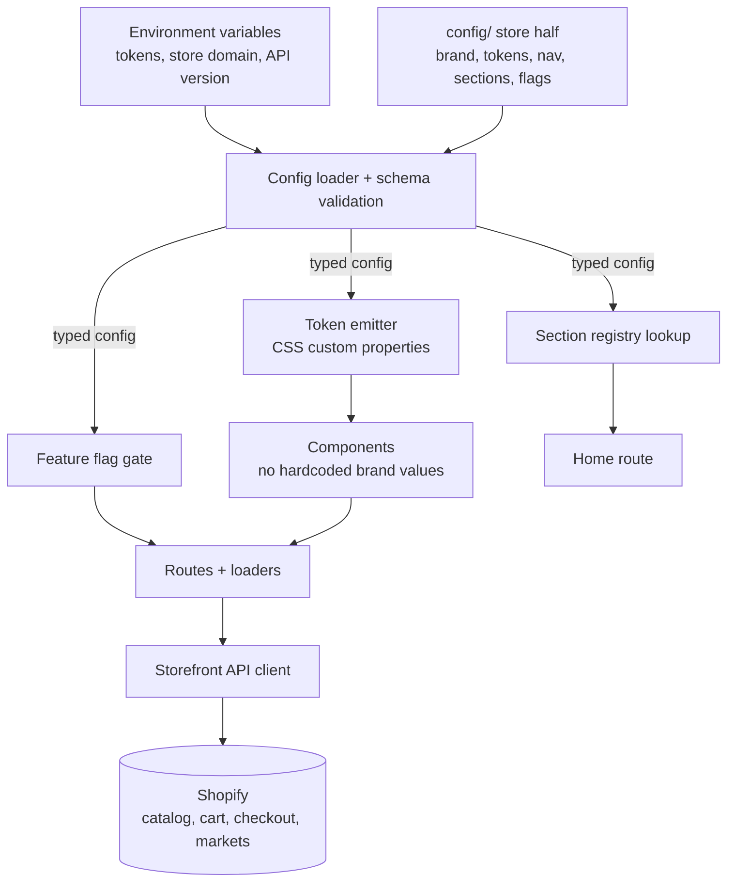

# PLAN: Difergent Theme

## Architecture

The repository has two halves. The **framework half** is generic Hydrogen code
that every derived store shares and that upstream keeps updating. The **store
half** is a configuration directory and a public asset directory that each
derived store owns. Nothing else is store-specific. REQ-6 is the rule that keeps
`git merge upstream/main` clean, so every design choice below exists to stop
store identity from leaking out of the store half.

Validation runs once at module load. A failure there is REQ-2's boot failure,
which is deliberately loud: a misconfigured store must not deploy and discover
the problem in production.

## Configuration contract

The store half is a directory of small typed modules rather than one large
object, so a merge conflict lands in one concern instead of the whole file.

| Module | Owns | Consumed by |
|---|---|---|
| `brand` | name, logo asset paths, contact and social links | header, footer, metadata |
| `tokens` | color, typography, spacing, radius | token emitter only |
| `navigation` | header and footer link structure | header, footer |
| `sections` | ordered list of homepage section names and their props | home route |
| `features` | boolean flags | flag gate |
| `seo` | title template, default description, default share image | metadata helpers |

Validation is a schema check over these modules, producing a typed value that
satisfies REQ-3. Environment variables are validated in the same pass so a
missing Storefront token fails identically to a missing brand name.

Tokens reach the browser as CSS custom properties emitted into the document
head, and Tailwind's theme references those properties. That is what makes
REQ-4 enforceable: a component naming a brand color directly is then visibly
wrong rather than merely discouraged. Every project stylesheet rule sits inside
an `@layer`, because an unlayered rule outranks every Tailwind utility no matter
its specificity, and the usual symptom of getting this wrong is reaching for
`!important` on a utility.

## Section registry

The registry maps a name to a component and its prop schema. Configuration
selects names; the build validates each name against the registry, which is
REQ-8. An unknown name is a build failure, not a silently missing section.

v1 registry, deliberately small: hero, featured collection grid, rich text,
image with text, collection list. Growth happens by adding a registry entry,
which is a framework-half change reviewed once and inherited by every store.

## Integrations & contracts

- **Storefront API** is the only data source. Queries live beside their routes,
  and types are generated by the project's codegen rather than written by hand.
  A query is only issued when its feature flag is on, which is the second half
  of REQ-5 and the reason a disabled feature costs nothing.
- **Cart** uses Hydrogen's cart handler and its session-backed cart identifier,
  which is what satisfies REQ-13 without inventing storage.
- **Markets** supplies currency, language, and country. Price formatting reads
  the market's currency and the active locale, satisfying REQ-16 with the
  platform's own `Intl` rather than a formatting dependency.
- **Checkout** is a handoff to the cart's Shopify checkout URL. No checkout
  state is modeled locally.
- **Consent** goes through Shopify's Customer Privacy API, gating analytics per
  REQ-21.
- **Oxygen** supplies the runtime, environment variables, and per-branch
  previews. Caching uses Hydrogen's own cache strategies per route rather than a
  bespoke layer.

## Operations, assets, and knowledge

Three things sit outside the application code but inside the delivery contract,
because a template is only plug-and-play if the surrounding steps are written
down.

- **Placeholder assets.** A fresh clone must render before any real photography
  exists. The bundled set matches the fixed media ratios so replacing a
  placeholder with a real image shifts no layout, and it reads as a stand-in
  rather than as fabricated brand content.
- **Runbooks.** Deployment covers the Oxygen variables, the Storefront API
  scopes, and the domain cutover. Notifications cover repointing Shopify email
  templates at the headless domain, because the default Liquid link variables
  resolve to the `myshopify.com` domain and quietly send buyers off the
  storefront. Neither runbook ever contains a secret value.
- **Living records.** The route map and the theming guide describe what exists,
  not what was planned. The theming guide references `DESIGN.md` token names and
  never restates their values, so the two cannot drift apart.

Automated checks run the type check, the lint rules including the token rule,
and the build on every push, so a broken upstream never reaches a store cloned
from it. Health probes make a deployed store checkable without reading logs.

## Risks & Mitigations

- **Configuration leaks into components.** This is the failure that ends the
  whole premise, and it happens gradually. Mitigation: tokens are the only path
  for brand values, and a lint rule rejects a hardcoded hex color or font family
  outside the token module.
- **Upstream merges become painful anyway.** Mitigation: the store half is
  append-only in shape, and any framework-half change that would force a store
  edit is treated as a breaking release with a stated migration step.
- **The section registry grows into a page builder.** Mitigation: v1 caps the
  registry, and content-driven composition through metaobjects stays an explicit
  future decision rather than a hedge built early.
- **A predictive search limit above 10 crashes the GraphQL request.** The
  Storefront API rejects it as a validation error rather than clamping.
  Mitigation: clamp at the query boundary, per REQ-15.
- **A green build is mistaken for a working storefront.** Mitigation: routes
  that render buyer-visible surfaces require browser evidence, not a passing
  build.
- **The storefront works in a desktop browser and fails in an in-app browser.**
  Most ad traffic arrives inside a host application, where viewport height is
  unstable, storage is more restricted, and bottom-fixed elements can sit under
  the host toolbar. Mitigation: the in-app browser constraints are a
  requirement, and their evidence comes from a real phone rather than device
  emulation.
- **A completion claim outlives its evidence.** Mitigation: every task names a
  runnable check, and a task touching a rendered surface is not done until that
  surface has been opened.
